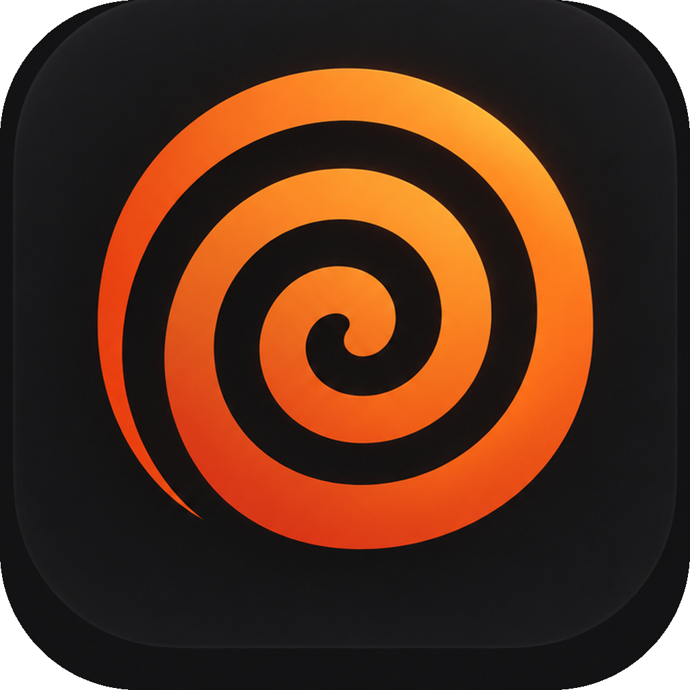

<div align="center">
  

# Cinnamon

**A companion app for Apple Music on Windows.** Live synced lyrics, Last.fm
scrobbling, fullscreen visualizers, Discord status and more, alongside the
Apple Music app you already use.

[Download](https://github.com/xigbotic/cinnamon/releases/latest) · [Report a bug](https://github.com/xigbotic/cinnamon/issues)

</div>

> **Beta.** Cinnamon is new, so expect rough edges. If something breaks, open
> Settings → Developer → **Copy diagnostics** and paste it into your
> [bug report](https://github.com/xigbotic/cinnamon/issues).

## Features

**Now playing**

- Cover art, progress and playback controls for whatever Apple Music is playing
- Mini player that stays on top of other windows
- Taskbar thumbnail buttons (previous / play-pause / next)
- Sleep timer: pause after 15–60 minutes or at the end of the track

**Lyrics**

- Synced lyrics from [LRCLIB](https://lrclib.net), plus the community
  [Juice WRLD API](https://juicewrldapi.com) for unreleased Juice WRLD tracks
- Optional word-by-word highlight (estimated from line timing unless the lyrics
  include word timings)
- Floating lyrics: a see-through strip that sits over fullscreen games and video
- Share cards: turn a few lines into a square or story-sized image

**Last.fm**

- Scrobbling with the standard rules (half the track or 4 minutes, 30 s minimum)
- Love tracks and see your play count for the current song
- Stats page: top artists, albums and tracks, a 30-day chart, your streak, and
  what you played on this day last year

**Fullscreen and visualizers**

- Immersive fullscreen with lyrics, or a visualizer-only mode
- 15 visualizers, from spectrum bars to GPU shaders, with quality settings
- Colours taken from the album art, reacting to your system audio (including
  VoiceMeeter / virtual mixer outputs)

**Everything else**

- Discord Rich Presence with customizable text
- Themes, including one that follows the album art, and a theme editor
- Global shortcuts, optional now-playing notifications, and auto-updates

## Install

1. Download `Cinnamon-Setup-<version>.exe` from the latest release on
   [GitHub](https://github.com/xigbotic/cinnamon/releases/latest).
2. Run it. The installer isn't code-signed yet, so Windows SmartScreen may warn
   you. Choose **More info → Run anyway**.
3. Open Apple Music and play something. The first launch walks you through
   connecting Last.fm, picking a theme and setting up audio for the visualizers.

**Requirements:** Windows 10 or 11 and the
[Apple Music app](https://apps.microsoft.com/detail/9pfhdd62mxs1). iTunes also
works, but Apple Music is what Cinnamon is built and tested with.

## Shortcuts

These work from any app. Turn them off in Settings → Keyboard Shortcuts.

| Shortcut | Action |
| --- | --- |
| `Ctrl` `Alt` `Space` | Play / pause |
| `Ctrl` `Alt` `→` / `←` | Next / previous track |
| `Ctrl` `Alt` `L` | Love / unlove on Last.fm |
| `Ctrl` `Alt` `O` | Floating lyrics |
| `Ctrl` `Alt` `M` | Mini player |
| `Ctrl` `Alt` `C` | Show Cinnamon |

In fullscreen: `←` / `→` change visualizer, `L` toggles lyrics, `K` toggles
word-by-word highlighting, `V` switches to visualizer-only, and `Esc` exits.

## Privacy

Cinnamon has no servers and no analytics. It talks to:

| Service | What it sends | Why |
| --- | --- | --- |
| Windows media session | Nothing (reads locally) | Knowing what Apple Music is playing |
| [Last.fm](https://www.last.fm/api) | Tracks you play (when connected) | Scrobbling, loves, play counts, stats |
| [LRCLIB](https://lrclib.net) | Track title, artist, album, length | Lyrics |
| [Juice WRLD API](https://juicewrldapi.com) | Track title (Juice WRLD only) | Lyrics and covers for unreleased songs |
| [iTunes Search API](https://performance-partners.apple.com/search-api) | Search terms, track title | Search, missing cover art, song links |
| Discord (local app) | Current track (when enabled) | Rich Presence |
| GitHub Releases | App version | Update checks |

Audio for the visualizers is analysed on your PC and never leaves it. Settings,
including your Last.fm session, are stored in `%APPDATA%\cinnamon`.

## Building from source

**You'll need:** Windows, [Node.js](https://nodejs.org) 20+, and
[Python](https://www.python.org) 3.10+ (for the small helper that reads
Windows' now-playing session).

```bash
git clone https://github.com/xigbotic/cinnamon.git
cd cinnamon
npm install
npm run sidecar:setup      # installs the Python helper's dependencies
```

Scrobbling needs a Last.fm API account. Create one at
[last.fm/api/account/create](https://www.last.fm/api/account/create), then copy
`.env.example` to `.env` and fill in the key and secret.

| Command | What it does |
| --- | --- |
| `npm run dev` | Runs the app with hot reload |
| `npm run typecheck` | Type-checks the main and renderer code |
| `npm run sidecar:build` | Builds the helper into a standalone `.exe` (needed before packaging) |
| `npm run dist` | Builds the installer into `release/` |
| `npm run release` | Builds and publishes a GitHub release (needs a `GH_TOKEN` env var) |

In development the helper runs straight from `sidecar/smtc_helper.py` using the
Python on your `PATH`, or the one set as `CINNAMON_PYTHON` in `.env`. Once
you've run `sidecar:build`, the compiled `.exe` is used instead.

### Releasing an update

Bump `version` in `package.json`, then run `npm run release` with a GitHub token
that can write to this repo. Installed copies download the new version in the
background and offer a restart.

### Project layout

```
src/main/       Electron main process: playback, scrobbling, lyrics, Discord, tray, updates
src/preload/    The bridge that exposes the app's API to the UI
src/renderer/   The UI: main window, mini player, floating lyrics, visualizers (src/viz/)
shared/         Types shared by all of the above
sidecar/        Python helper that reads Windows' media session
```

## Credits

Lyrics from [LRCLIB](https://lrclib.net) and the
[Juice WRLD API](https://juicewrldapi.com). Catalog data and artwork from the
[iTunes Search API](https://performance-partners.apple.com/search-api). Built
with [Electron](https://www.electronjs.org),
[electron-vite](https://electron-vite.org) and
[@xhayper/discord-rpc](https://github.com/xhayper/discord-rpc).

Cinnamon isn't affiliated with or endorsed by Apple, Last.fm or Discord. Apple
Music is a trademark of Apple Inc.

## License

[MIT](LICENSE) © 2026 Xigbotic
